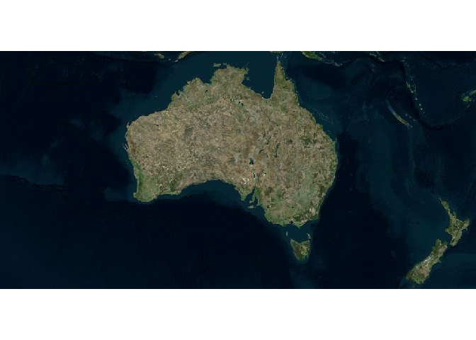
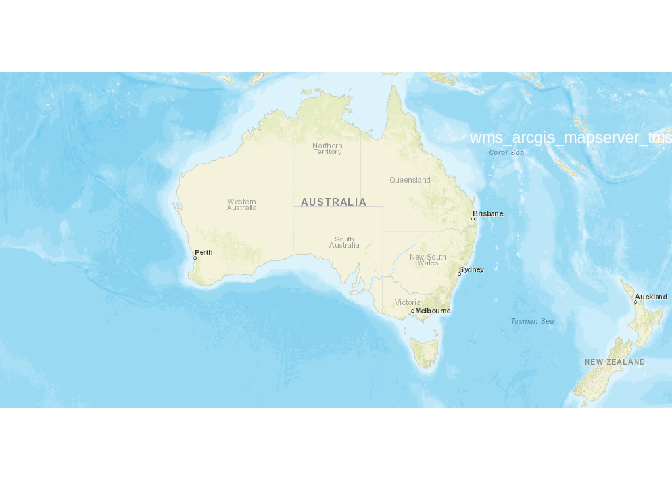
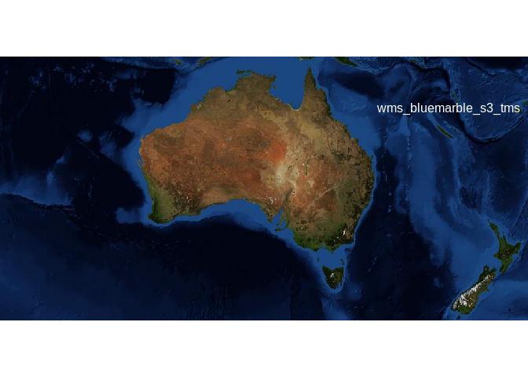
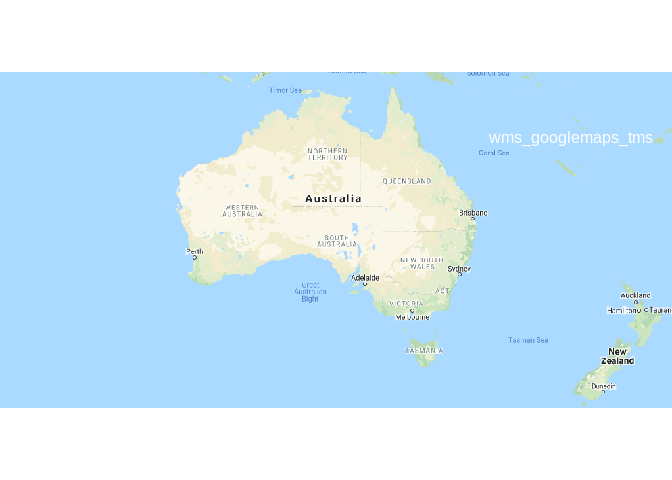
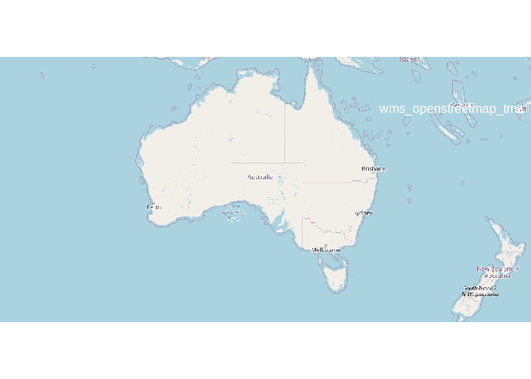

<!-- README.md is generated from README.Rmd. Please edit that file -->

# gdalwebsrv

<!-- badges: start -->

<!-- badges: end -->

The goal of gdalwebsrv is to provide access to some online image servers
using standard tools.

This package contains no code for *reading rasters*, it’s simply a
convenient way to access *configuration files* that can be used as
sources of web imagery.

WIP, currently pretty limited there are only 5 sources (from 17 ) that
we allow in for now while things are figured out.

## Installation

``` r
remotes::install_github("hypertidy/gdalwebsrv")
```

You can install the released version of gdalwebsrv from
[CRAN](https://CRAN.R-project.org) with:

``` r
install.packages("gdalwebsrv")
```

## Example

This is a basic example which shows you how to solve a common problem:

``` r
library(gdalwebsrv)

available_sources()
#> [1] "wms_arcgis_mapserver_tms" "wms_bluemarble_s3_tms"   
#> [3] "wms_googlemaps_tms"       "wms_openstreetmap_tms"   
#> [5] "wms_virtualearth"

srcfile <- server_file("wms_virtualearth")

raster::brick(srcfile)
#> Warning in showSRID(uprojargs, format = "PROJ", multiline = "NO"): Discarded
#> ellps WGS 84 in CRS definition: +proj=merc +a=6378137 +b=6378137 +lat_ts=0
#> +lon_0=0 +x_0=0 +y_0=0 +k=1 +units=m +nadgrids=@null +wktext +no_defs
#> Warning in showSRID(uprojargs, format = "PROJ", multiline = "NO"): Discarded
#> datum WGS_1984 in CRS definition
#> class      : RasterBrick 
#> dimensions : 134217728, 134217728, 1.80144e+16, 3  (nrow, ncol, ncell, nlayers)
#> resolution : 0.2985821, 0.2985821  (x, y)
#> extent     : -20037508, 20037508, -20037508, 20037508  (xmin, xmax, ymin, ymax)
#> crs        : +proj=merc +a=6378137 +b=6378137 +lat_ts=0 +lon_0=0 +x_0=0 +y_0=0 +k=1 +units=m +nadgrids=@null +wktext +no_defs 
#> source     : /perm_storage/home/mdsumner/R/x86_64-pc-linux-gnu-library/4.0/gdalwebsrv/gdalwmsxml/frmt_wms_virtualearth.xml 
#> names      : frmt_wms_virtualearth.1, frmt_wms_virtualearth.2, frmt_wms_virtualearth.3 
#> min values :                       0,                       0,                       0 
#> max values :                     255,                     255,                     255

stars::read_stars(srcfile, proxy = TRUE)
#> stars_proxy object with 1 attribute in file:
#> $frmt_wms_virtualearth.xml
#> [1] "[...]/frmt_wms_virtualearth.xml"
#> 
#> dimension(s):
#>      from        to    offset     delta                      refsys point
#> x       1 134217728 -20037508  0.298582 Google Maps Global Mercator    NA
#> y       1 134217728  20037508 -0.298582 Google Maps Global Mercator    NA
#> band    1         3        NA        NA                          NA    NA
#>      values    
#> x      NULL [x]
#> y      NULL [y]
#> band   NULL

ex <- c(xmin = 1e7, xmax = 2e7, ymin = -6e6, -1e6)

## not sure how to *read* sensibly from those yet so rely on lazyraster for now
  library(lazyraster)
#> 
#> Attaching package: 'lazyraster'
#> The following object is masked from 'package:graphics':
#> 
#>     plot
#> The following object is masked from 'package:base':
#> 
#>     plot
  lr <- lazyraster(srcfile)

  cr <- crop(lr, ex)
  rr <- raster::brick(as_raster(cr, band = 1), 
              as_raster(cr, band = 2), 
            as_raster(cr, band = 3))

  
  library(raster)
#> Loading required package: sp
plotRGB(rr)
```



``` r


read_ex <- function(name, ex) {
  library(lazyraster)
  srcfile <- server_file(name)
  lr <- lazyraster(srcfile)

  cr <- crop(lr, ex)
  rr <- raster::brick(as_raster(cr, band = 1), 
              as_raster(cr, band = 2), 
            as_raster(cr, band = 3))

  rr
}
srcs <- available_sources()
for (i in seq_along(srcs)) {
  plotRGB(read_ex(srcs[i], ex))
  text(ex[2] - 1.5e6, ex[4] - 1e6, lab = srcs[i], col = "white")
}
```



## Code of Conduct

Please note that the gdalwebsrv project is released with a [Contributor
Code of
Conduct](https://contributor-covenant.org/version/2/0/CODE_OF_CONDUCT.html).
By contributing to this project, you agree to abide by its terms.
