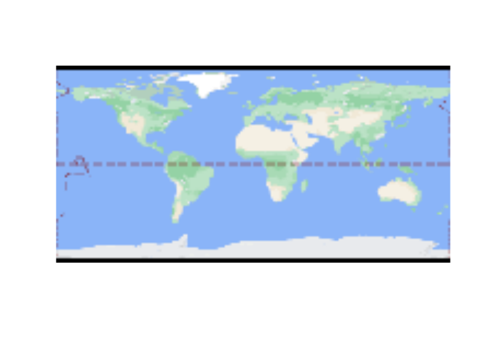
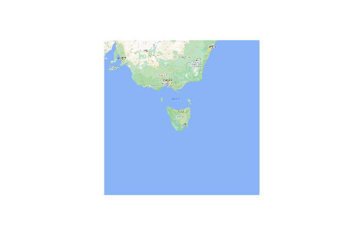
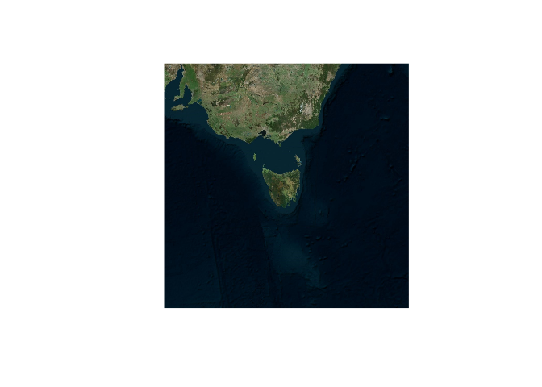
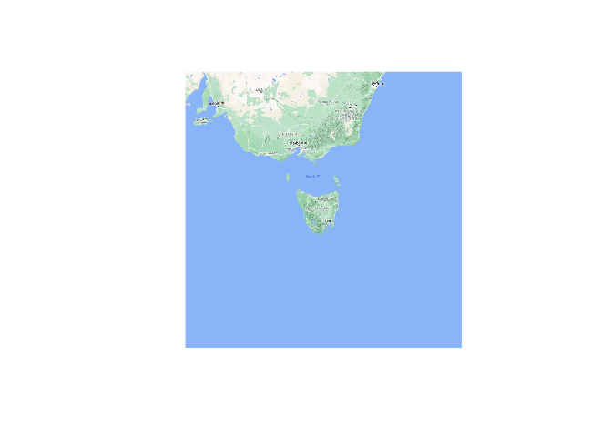
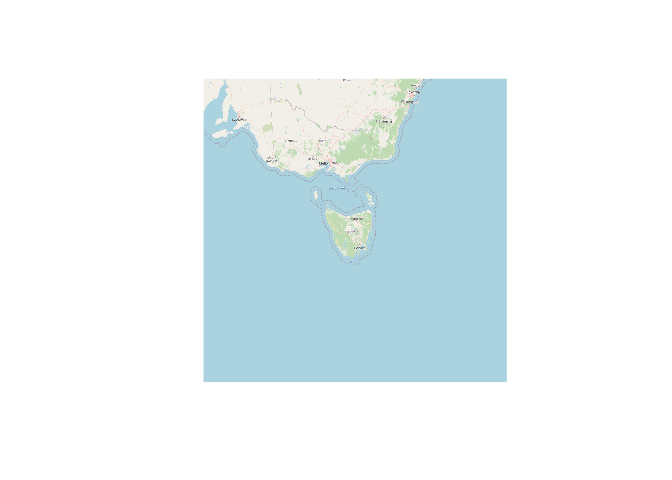
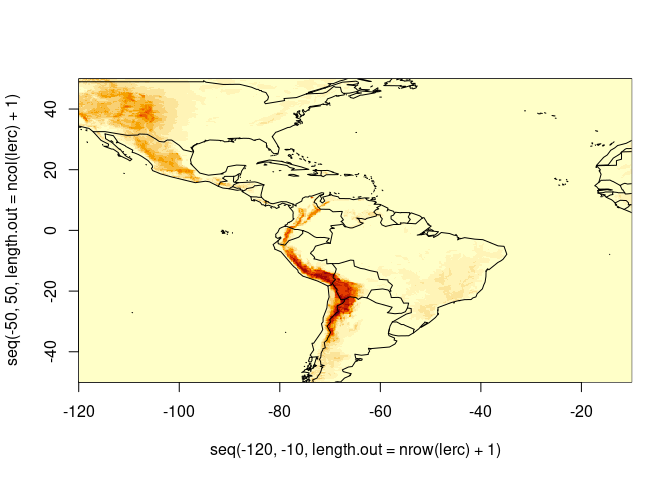

<!-- README.md is generated from README.Rmd. Please edit that file -->

# gdalwebsrv

<!-- badges: start -->
<!-- badges: end -->

The goal of gdalwebsrv is to provide access to some online image servers
using standard tools.

This package contains no code for *reading rasters*, it’s simply a
convenient way to access *configuration files* that can be used as
sources of web imagery.

WIP, currently pretty limited there are only 5 sources (from 17 ) that
we allow in for now while things are figured out.

## Installation

``` r
remotes::install_github("hypertidy/gdalwebsrv")
```

You can install the released version of gdalwebsrv from
[CRAN](https://CRAN.R-project.org) with:

``` r
install.packages("gdalwebsrv")
```

## Example

This is a basic example to get various kinds of imagery.

Each `server_file()` is a path to a GDAL readable tile server, one of
each of the `available_sources()`.

``` r
library(gdalwebsrv)

available_sources()
#>  [1] "wms_arcgis_mapserver_ESRI.WorldImagery_tms"
#>  [2] "wms_arcgis_terrain_tms_lerc"               
#>  [3] "wms_bluemarble_s3_tms"                     
#>  [4] "wms_googlemaps_hybrid_tms"                 
#>  [5] "wms_googlemaps_satellite_tms"              
#>  [6] "wms_googlemaps_terrain_tms"                
#>  [7] "wms_googlemaps_terrainextra_tms"           
#>  [8] "wms_googlemaps_tms"                        
#>  [9] "wms_openstreetmap_tms"                     
#> [10] "wms_virtualearth"

## all this package does is keep a list of these 
gmap_file <- server_file("wms_googlemaps_tms")
```

Now we might use the server one way or another.

``` r
library(gdalio)
g <- gdalio_graphics(gmap_file)
plot(g)
```



``` r
gdalio_set_default_grid(list(extent = c(-1, 1, -1, 1) * 1e6, 
                            dimension = c(1024, 1024), 
                            projection = "+proj=laea +lon_0=147 +lat_0=-42"))
gmap <- gdalio_graphics(gmap_file)
plot(gmap)
```



``` r
vmap <- gdalio_graphics(server_file("wms_virtualearth"))
plot(vmap)
```



``` r
temap <-  gdalio_graphics(server_file("wms_googlemaps_terrainextra_tms"))
plot(temap)
```



``` r
omap <- gdalio_graphics(server_file("wms_openstreetmap_tms"))
plot(omap)
```



Something different.

``` r
gdalio_set_default_grid(list(extent = c(-120, -10, -50, 50), 
                            dimension = c(768, 512)/1.5, 
                            projection = "+proj=longlat"))

lerc <-  gdalio_matrix(server_file("wms_arcgis_terrain_tms_lerc"), bands = 1)
image(seq(-120, -10, length.out = nrow(lerc) + 1), 
          seq(-50, 50, length.out = ncol(lerc) + 1), lerc)
maps::map(add = TRUE)
```



## Code of Conduct

Please note that the gdalwebsrv project is released with a [Contributor
Code of
Conduct](https://contributor-covenant.org/version/2/0/CODE_OF_CONDUCT.html).
By contributing to this project, you agree to abide by its terms.
